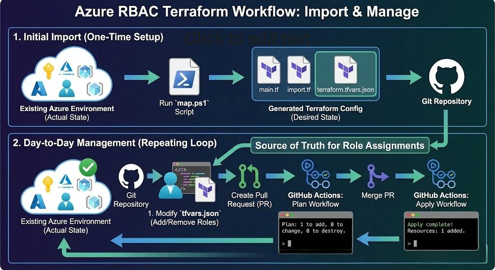
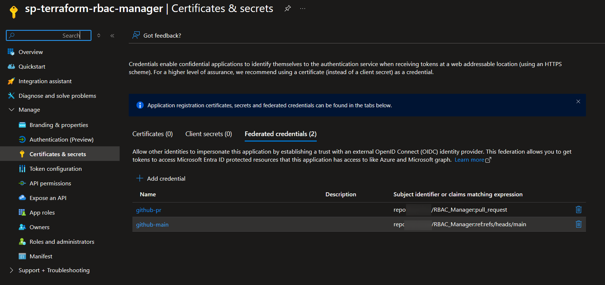
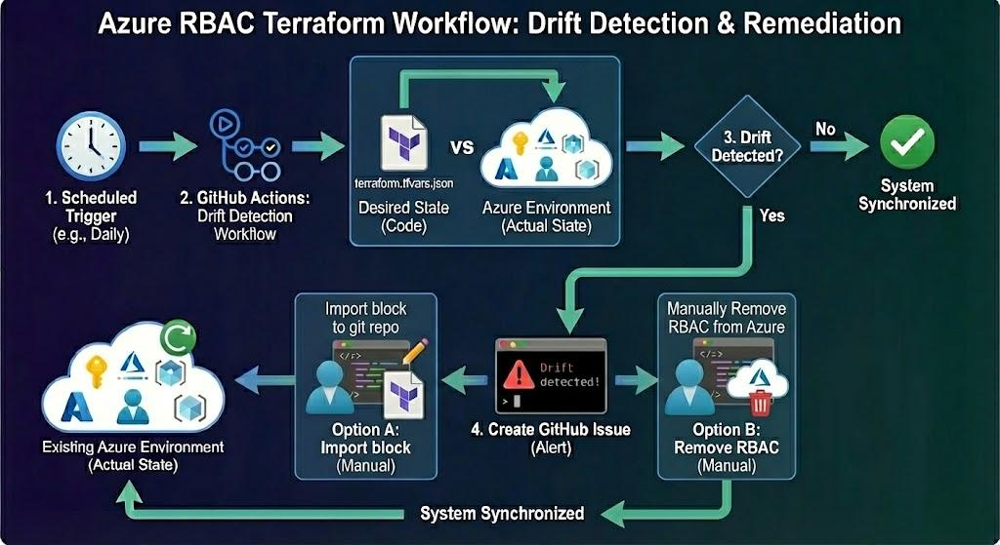

# Azure RBAC Terraform Mapper

Manage Azure RBAC role assignments as code using Terraform, with automated drift detection via GitHub Actions.

## Overview

This solution helps you:

- **Export existing RBAC role assignments** from Azure subscriptions into Terraform configuration
- **Manage role assignments with Infrastructure as Code** with version control and pull request reviews
- **Detect configuration drift** automatically via scheduled GitHub Actions workflows
- **Apply changes safely** with plan-on-PR and apply-on-merge workflows

## How It Works

1. Run the provided `map.ps1` PowerShell script to scan specified Azure subscriptions. The script maps out all of the existing role assignments un the subscription (at all scopes) and generates Terraform configuration and variables files.
2. Terraform import blocks are generated to import existing role assignments into Terraform state.
3. Corresponding variables files are created to define the desired state of role assignments. These files can be used later to add, remove, or modify role assignments.
4. After the files are generated by the script, commit and push the generated files to a new branch in your GitHub repository and create a pull request.
5. GitHub Actions workflows are set up to:
   - `terraform plan` is triggered on pull requests to show proposed changes.
   - `terraform apply` is triggered on merges to the main branch to enforce changes (for approved and completed PRs).
   - `detect-rbac-drift` runs on a schedule to check for any drift between the actual state in Azure and the desired state defined in Terraform. If any drift is detected, an issue is created in the repository for review.




## Prerequisites

- **Azure PowerShell module** linked [here](https://learn.microsoft.com/en-us/powershell/azure/install-az-ps)
- **Terraform** >= 1.6
- **GitHub Runners** with PowerShell and Terraform installed (if using self-hosted runners)
- **GitHub repository** for storing the configuration
- **Azure Storage Account** for Terraform state backend
- **Azure CLI** if you are following the setup steps below

---

## Setup Guide

### Step 0: Fork this Repository
1. Go to this repository on GitHub.
2. Click the "Fork" button in the top-right corner to create a copy in your own GitHub account.

### Step 1: Create Azure Storage Account for Terraform State

Create a storage account to store Terraform state files:

```pwsh
# Login to Azure
az login

# Create resource group
az group create --name rg-terraform-state --location eastus

# Create storage account (name must be globally unique)
az storage account create `
  --name tfstate<unique-suffix> `
  --resource-group rg-terraform-state `
  --location eastus `
  --sku Standard_LRS `
  --allow-blob-public-access false `
  --min-tls-version TLS1_2

# Create container for state files
az storage container create `
  --name tfstate `
  --account-name tfstate<unique-suffix>
  --auth-mode login
```

### Step 2: Create Service Principal with OIDC for GitHub Actions

GitHub Actions will authenticate to Azure using OIDC (OpenID Connect) - no secrets to rotate!

#### 2.1 Create App Registration

```pwsh
# Create the app registration
az ad app create --display-name "sp-terraform-rbac-manager"

# Note the appId (Client ID) from the output
```

#### 2.2 Create Service Principal

```pwsh
# Get the App ID from previous step
$APP_ID = "<your-app-id>"

# Create service principal
az ad sp create --id $APP_ID
```

#### 2.3 Configure Federated Credentials for GitHub OIDC

Replace `<your-org>` and `<your-repo>` with your GitHub repository details:

```pwsh
$APP_OBJECT_ID = az ad app show --id $APP_ID --query id -o tsv

# Credential for pull requests (terraform plan)
@{
  name = "github-pr"
  issuer = "https://token.actions.githubusercontent.com"
  subject = "repo:<your-org>/<your-repo>:pull_request"
  audiences = @("api://AzureADTokenExchange")
} | ConvertTo-Json | Set-Content github-pr.json
az ad app federated-credential create --id $APP_OBJECT_ID --parameters "@github-pr.json"

# Credential for main branch (terraform apply)
@{
  name = "github-main"
  issuer = "https://token.actions.githubusercontent.com"
  subject = "repo:<your-org>/<your-repo>:ref:refs/heads/main"
  audiences = @("api://AzureADTokenExchange")
} | ConvertTo-Json | Set-Content github-main.json
az ad app federated-credential create --id $APP_OBJECT_ID --parameters "@github-main.json"

# Clean up temporary files
Remove-Item github-pr.json, github-main.json
```

if you have configured the SP correctly, you should see the federated credentials listed:



#### 2.4 Assign Required RBAC Permissions

The service principal needs permissions to:
1. **Manage role assignments** on target subscriptions
2. **Read/write Terraform state** in the storage account

```pwsh
$SP_OBJECT_ID = az ad sp show --id $APP_ID --query id -o tsv

# User Access Administrator on each subscription (to manage role assignments)
az role assignment create `
  --assignee-object-id $SP_OBJECT_ID `
  --assignee-principal-type ServicePrincipal `
  --role "User Access Administrator" `
  --scope "/subscriptions/<subscription-id>"

# Reader on each subscription (to read resources)
az role assignment create `
  --assignee-object-id $SP_OBJECT_ID `
  --assignee-principal-type ServicePrincipal `
  --role "Reader" `
  --scope "/subscriptions/<subscription-id>"

# Storage Blob Data Contributor on state storage account
az role assignment create `
  --assignee-object-id $SP_OBJECT_ID `
  --assignee-principal-type ServicePrincipal `
  --role "Storage Blob Data Contributor" `
  --scope "/subscriptions/<subscription-id>/resourceGroups/rg-terraform-state/providers/Microsoft.Storage/storageAccounts/tfstate<unique-suffix>"
```

### Step 3: Configure GitHub Secrets

Add the following secrets to your GitHub repository:

| Secret Name | Value |
|-------------|-------|
| `AZURE_CLIENT_ID` | The App Registration Client ID (App ID) |
| `AZURE_TENANT_ID` | Your Azure AD Tenant ID |
| `AZURE_SUBSCRIPTION_ID` | Subscription ID where the Terraform state storage account resides (not the subscriptions being managed) |

To find your Tenant ID:
```pwsh
az account show --query tenantId -o tsv
```

Go to your GitHub repository → **Settings** → **Secrets and variables** → **Actions** → **New repository secret** 3 times to add the above secrets.

---

### Step 4: Running the Mapper Script

The `map.ps1` script scans Azure subscriptions and generates Terraform configuration:

```powershell
./map.ps1 -SubscriptionIds @("<subscription-id-1>", "<subscription-id-2>") `
      -StorageAccountName "tfstate<unique-suffix>" `
      -StorageAccountResourceGroup "rg-terraform-state"
```

#### Parameters

| Parameter | Required | Description |
|-----------|----------|-------------|
| `-SubscriptionIds` | Yes | One or more Azure subscription IDs to scan |
| `-StorageAccountName` | Yes | Storage account name for Terraform state |
| `-StorageAccountResourceGroup` | Yes | Resource group containing the storage account |
| `-StorageAccountContainer` | No | Container name (default: `tfstate`) |

#### Examples

**Single subscription:**
```powershell
./map.ps1 -SubscriptionIds "12345678-1234-1234-1234-123456789012" `
          -StorageAccountName "tfstatemycompany" `
          -StorageAccountResourceGroup "rg-terraform-state"
```

**Multiple subscriptions:**
```powershell
./map.ps1 -SubscriptionIds "sub-id-1", "sub-id-2", "sub-id-3" `
          -StorageAccountName "tfstatemycompany" `
          -StorageAccountResourceGroup "rg-terraform-state"
```

### Generated Files

The script creates the following structure:

```
subscriptions/
├── <subscription-name>/
│   ├── main.tf              # Terraform configuration with RBAC module
│   ├── backend.tf           # Azure backend configuration
│   ├── import.tf            # Import blocks for existing role assignments
│   └── terraform.tfvars.json # Role assignment data
```

Now everything is ready to run plan and apply to import and manage role assignments (steps continued in the next section).

---

### Step 5: GitHub Actions Workflows and Pull Requests

#### Branch, commit and push the generated files
1. Create a new branch in your GitHub repository using ```git checkout -b rbac-mapping```
2. Add the generated files to git: `git add .`
3. Commit the changes: `git commit -m "Import Azure RBAC role assignments"`
4. Push the branch: `git push origin rbac-mapping`


#### Terraform Plan on Pull Requests

1. Open a pull request against the `main` branch
2. The GitHub Actions workflow `terraform-plan.yml` triggers automatically
3. Review the Terraform plan output in the PR checks TODO: add image here
4. You should ony see `resources to import` and 0 for create, destroy, or change

#### Terraform Apply on Merge

1. If you are satisfied with the plan, merge the PR into `main`
2. The GitHub Actions workflow `terraform-apply.yml` triggers automatically
3. **The role assignments are now managed by Terraform!**

## Managing Role Assignments
Now that the role assignments are imported into Terraform, you can manage them via code. to do so:
1. open the releveat directory under `subscriptions/<subscription-name>/`
2. edit the `terraform.tfvars.json` file to add, remove, or modify role assignments (note that each record in the json file has a numeric key, Keys are meaningless, they should just be unique within the file)
3. You can add roles, modify roles or remove roles by editing the json file:


   ```json
   {
     "permissions": {
       "0": { ... },
       "1": {
         "roleDefinitionName": "Reader",
         "scope": "/subscriptions/<sub-id>/resourceGroups/<rg-name>",
         "principalId": "<user-or-group-object-id>"
       }
     }
   }
   ```

4. add commit and push to a new branch
5. open a pull request against `main`
6. review the plan output in the PR checks
7. merge the PR to apply the changes


## Drift Detection

A scheduled workflow runs daily to detect configuration drift. Configuration drift occurs when role assignments are changed outside of Terraform (e.g., manually in the Azure portal). To keep control over your role assignments, the drift detection workflow runs daily and creates an issue if any drift is detected. specifically, the workflow:
1. Runs a powershell script that:
   - Scans the specified subscriptions for current role assignments
   - Compares the current state with the desired state defined in the Terraform configuration
   - If differences are found, it reports them
2. Creates an issue if drift is detected and posts the details of the drift in the issue body



---

## Troubleshooting

### Authentication Errors

If GitHub Actions fails with authentication errors:
- Verify the federated credentials are configured correctly
- Check that the subject claim matches your repository and branch/PR
- Ensure the secrets are set correctly in GitHub

### Permission Errors


---


## Contributing

1. Fork the repository
2. Create a feature branch
3. Make your changes
4. Submit a pull request

---

## License

MIT License - see [LICENSE](LICENSE) for details.

---

## Disclaimer

This project is provided as a helpful starting point for managing Azure RBAC with Terraform. While we've done our best to make it reliable, please review Terraform plans before applying changes and test in a non-production environment first. As with any infrastructure automation, following best practices for backups and change management is recommended.
